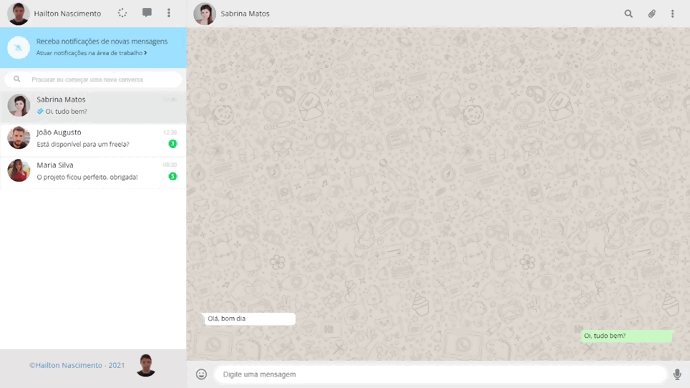

  

<h1 align="center">
 <a href="https://hailton-nascimento.github.io/DoceriaAnaMaria/" target="_blank" rel="noopener noreferrer">Demo</a>
</h1>

# Clone WhatsApp Web

Clone da página do WhatsApp Web.

## Objetivo

-  Clonar página do WhatsApp Web, com um layout básico utilizando Html e CSS para aprendizado e aperfeiçoamento no desenvolvimento de Layout.

<h2 id="tecnologias">
    🚀 Tecnologias utilizadas
</h2>

Foram utilizadas as seguintes tecnologias:

<ul>
    <li>HTML</li>
    <li>CSS</li>

</ul>

---

### Contato

- Github - [Hailton Nascimento](https://github.com/Hailton-Nascimento)
- LinkedIn - [Hailton Nascimento](https://linkedin.com/in/hailton-nascimento)

<!-- [![LinkedIn][linkedin-shield]][linkedin-url]
<!-- MARKDOWN LINKS & IMAGES -->
<!-- https://www.markdownguide.org/basic-syntax/#reference-style-links -->

<!-- [linkedin-shield]: https://img.shields.io/badge/-LinkedIn-black.svg?style=for-the-badge&logo=linkedin&colorB=555
[linkedin-url]: https://linkedin.com/in/hailton-nascimento -->

